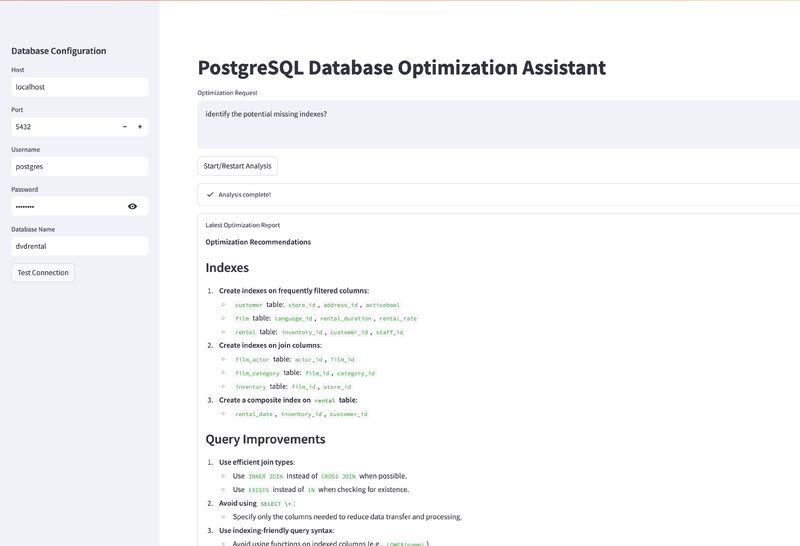

# Stonebraker: The PostgreSQL Performance Optimization AI Agent 🚀

[](https://www.gnu.org/licenses/agpl-3.0)
[](https://www.python.org/downloads/)
[](https://www.postgresql.org/)
[](https://github.com/yourusername/stonebraker/releases)

## ⚠️ Disclaimer

**This is a beta release (v0.1-beta) and NOT production-ready software. Use at your own risk.**
- This tool may suggest database changes that could impact performance
- Always test suggestions in a non-production environment first
- Back up your database before applying any changes

## Motivation 💭

Database performance optimization is a critical yet complex task that requires deep expertise in SQL, query planning, and system architecture. Many organizations struggle with:

- **Complex Query Analysis**: Identifying bottlenecks in large SQL queries
- **Schema Design Decisions**: Making optimal choices for indexes and constraints
- **Performance Testing**: Lack of automated tools for before/after comparisons
- **Risk Management**: Fear of making changes that might degrade performance
- **Knowledge Gap**: Limited access to database optimization experts

This project aims to democratize database optimization by combining the power of Large Language Models (LLMs) with automated testing and analysis tools, making expert-level optimization accessible to all developers.

## Project Description 📝

Stonebraker is an intelligent system that:

1. **Analyzes Database Schemas**: 
   - Automatically scans table structures
   - Identifies missing indexes
   - Suggests optimal data types
   - Recommends partitioning strategies

2. **Optimizes Queries**:
   - Rewrites complex queries for better performance
   - Suggests materialized views
   - Identifies common anti-patterns
   - Provides explain plan analysis

3. **Tests Performance**:
   - Runs automated benchmarks
   - Compares query execution times
   - Measures resource utilization
   - Generates detailed reports

4. **Ensures Safety**:
   - Provides rollback capabilities
   - Tests changes in isolation
   - Validates optimization impacts
   - Prevents destructive changes

The AI agent leverages state-of-the-art LLMs through Groq's high-performance API or local Ollama models, combining their analytical capabilities with practical database optimization techniques.

## 🎯 Introduction

Stonebraker is an intelligent system that combines LLM capabilities with database optimization techniques to help developers improve their PostgreSQL database performance. It analyzes schemas, suggests optimizations, and provides automated testing of changes.

### Key Features

- 🔍 Automated schema analysis and optimization suggestions
- 📊 Query performance testing and benchmarking
- 🛠️ LLM-powered query rewriting and improvement
- 📈 Before/After performance comparison
- 🔄 Safe rollback capabilities
- 🤖 AI-driven insights for better decision making

## 🚀 Quick Start

```bash
# Clone the repository
git clone https://github.com/cloudraftio/stonebraker.git
cd stonebraker

# Create and activate virtual environment
python -m venv venv
source venv/bin/activate

# Install dependencies
pip install -r requirements.txt

# Set up environment variables
cp .env.example .env
# Edit .env with your credentials

# Start the application
streamlit run app.py
```

## 📋 Prerequisites

1. **Python Environment**
   - Python 3.8 or higher
   - pip package manager
   - virtualenv or venv

2. **PostgreSQL Setup**
   - PostgreSQL 14+ installed and running
   - Database user with appropriate permissions
   - Access to EXPLAIN ANALYZE privileges

3. **LLM Provider (choose one)**
   - Groq API account and API key
   - Ollama local setup with supported models

## 🔧 Installation Details

1. **Python Dependencies**
```bash
pip install -r requirements.txt
```

2. **Configuration**
   - Copy `.env.example` to `.env`
   - Configure database connection
   - Add LLM provider credentials

## 📖 Example Usage

*StonebrakerAI Dashboard*

## 🤝 Contributing

We welcome contributions! Please follow these steps:

1. Check existing issues or create a new one
2. Fork the repository
3. Create a feature branch (`git checkout -b feature/amazing-feature`)
4. Commit your changes (`git commit -m 'Add amazing feature'`)
5. Push to the branch (`git push origin feature/amazing-feature`)
6. Open a Pull Request

### Development Setup
```bash
# Install dev dependencies
pip install -r requirements.txt

# Run tests
python -m pytest
```

## 🗺️ Roadmap

### v0.1-beta (Current)
- [x] Basic schema analysis
- [x] Query optimization suggestions
- [x] Performance testing framework

## 🧹 Security & Maintenance

Before contributing or deploying:
1. Run `pre-commit run --all-files` to clean sensitive data
2. Check for credentials in git history
3. Verify no API tokens in code
4. Remove unnecessary files

## 📞 Contact & Support

- **Issues**: Use [GitHub Issue Tracker](https://github.com/yourusername/stonebraker/issues)
- **Discussion**: Join our [Slack Channel](https://github.com/cloudraftio/stonebraker)

## 📄 License

The  is distributed under AGPL-3.0-only.